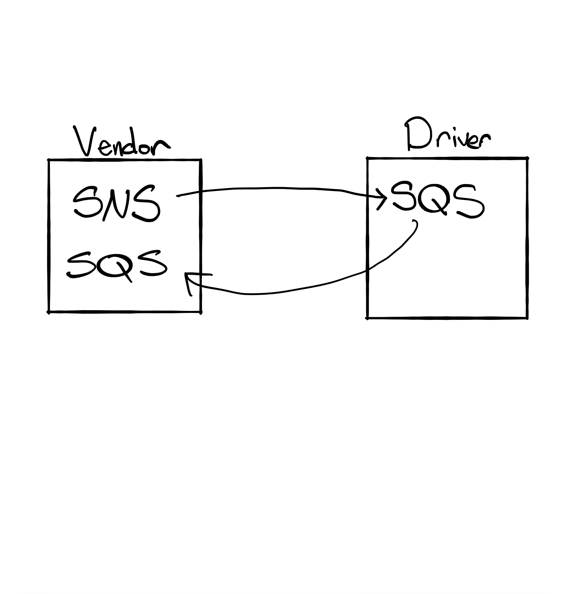
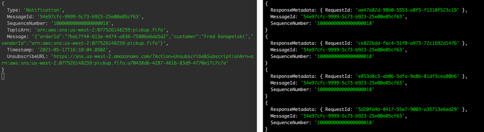

# LAB - Class 19

## Project: AWS: Events

### Author: Ellis Yoo

### Links and Resources

- [AWS SNS](https://us-west-2.console.aws.amazon.com/sns/v3/home?region=us-west-2#/topic/arn:aws:sns:us-west-2:077526148259:pickup.fifo)
- [AWS SQS](https://us-west-2.console.aws.amazon.com/sqs/v2/home?region=us-west-2#/queues/https%3A%2F%2Fsqs.us-west-2.amazonaws.com%2F077526148259%2Fvendor)

### Setup
Run the application by running `node driver.js` and `node vendor.js` on the terminal seperately.
#### UML / Application Wiring Diagram

#### Logs
